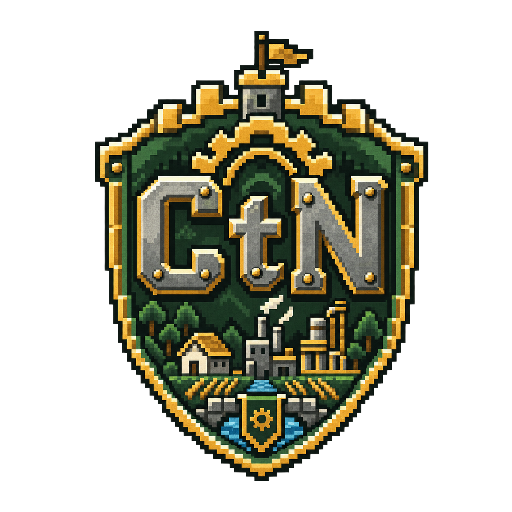

# Craft to Nation



**Craft to Nation** es un juego de supervivencia, construcción y estrategia en el que el jugador transforma un refugio en una nación industrial viva.

**Sitio web:** [crafttonation.netlify.app](https://crafttonation.netlify.app)

El proyecto está en etapa de pruebas de concepto. El desarrollo actual valida sus sistemas principales de forma incremental sobre un único proyecto de Godot, siguiendo el [GDD v3.23](Documento%20de%20Diseño%20de%20Juego%20%28GDD%29_%20Craft%20to%20Nation.md).

## Estado actual

- **Fase 0 — completada:** PoC 1 y 2 validan la lógica de recursos, demografía, nivel urbano, serialización y reglas de blueprints y zonas.
- **Fase 1 — verificada:** PoC 3 implementa el prototipo en primera persona sobre `GridMap`, minado y colocación, detección y validación de edificios, y objetos multicelda.
- **Fase 2 — en progreso:** PoC 4 integra `Ciudad` y `Avatar` como autoload, HUD, zonificación funcional y una cámara cenital navegable. El vínculo con el jugador es parcial y los colonos NPC siguen pendientes.
- **Fase 3 — en progreso:** los cuatro subproyectos de PoC 6 están completos con alcance reducido; PoC 5 (diseño de balance del catálogo de recursos) está pendiente. El mundo procedural finito de 200×200 celdas incluye relieve, subsuelo, vetas de hierro, cuerpos de agua estáticos, señales de bioma y árboles procedurales talables. La cámara cenital permite nivelar terreno y colocar minas con previsualización y estadísticas en vivo. Siguen pendientes los puestos de caza y recolección vegetal.
- **Fases 4–7 — planeadas:** cámara dual y tropas, logística y puentes, combate e IA, y multijugador LAN.
- **Visión a largo plazo:** eras tecnológicas posteriores al nivel urbano actual y un servidor MMO por planetas, todavía sin PoC ni fase asignada.

El proyecto Godot cuenta actualmente con **64 pruebas**: 15 de blueprints y construcción, 7 de ciudad, 8 de zonificación, 15 de generación del mundo, 10 de árboles procedurales, 4 de nivelación de terreno y 5 de recolección.

## Ideas incorporadas al roadmap

- **Mundo procedural finito:** implementado como primer subproyecto de PoC 6.
- **Nivelación de terreno sobre relieve:** implementada y confirmada visualmente con una huella manual de 5×5 y sin costo de recursos; su integración con edificios reales queda pendiente.
- **Minas y previsualización en el HUD:** implementadas y confirmadas visualmente con vetas de hierro, detección de recursos, colocación desde la cámara cenital y estadísticas en vivo.
- **Bioma y vegetación:** implementadas las señales de fauna, frutales y árboles; el mundo genera árboles procedurales talables y el jugador puede talarlos mediante acciones repetidas.
- **Puestos de caza y recolección vegetal:** pendientes como edificios jugables, aunque ya existen las señales de terreno que necesitan.
- **Cuerpos de agua:** implementados como mares y lagos estáticos por nivel de mar; ríos, corrientes, natación y agua transparente siguen pendientes.
- **Puentes:** previstos como PoC 10 en la Fase 5, reutilizando el trazado de las redes de transporte.
- **Tallado cosmético por celda:** previsto como pulido visual, sin fase propia.
- **Túneles y cavernas:** previstos a futuro; dependen de la generación de terreno y de las mecánicas de combate.

El contexto y la ubicación de estas ideas se conservan en [docs/ideas-backlog.md](docs/ideas-backlog.md).

## Estructura

```text
PoC_1/     Motor lógico de recursos y demografía
PoC_2/     Serialización y validación de blueprints
PoC_3/     Documento técnico del prototipo visual
PoC_4/     Documentos técnicos de ciudad y zonificación
PoC_6/     Documentos técnicos del mundo y recolección
godot/     Proyecto compartido desde PoC 3
docs/      Especificaciones, planes e ideas del backlog
```

## Ejecutar el prototipo

1. Instala Godot 4.7.
2. Importa `godot/project.godot` (proyecto Godot compartido, usado por PoC_3 en adelante).
3. Ejecuta el proyecto con **F5**.

Para correr las pruebas de Godot, abre cada escena y usa **F6**:

- `godot/scenes/Test.tscn`
- `godot/scenes/CiudadTest.tscn`
- `godot/scenes/ZonificacionTest.tscn`
- `godot/scenes/GeneradorMundoTest.tscn`
- `godot/scenes/GeneradorArbolTest.tscn`
- `godot/scenes/NiveladorTerrenoTest.tscn`
- `godot/scenes/RecoleccionTest.tscn`

## Contribuir

Consulta [CONTRIBUTING.md](CONTRIBUTING.md) antes de enviar cambios. Se aceptan aportes humanos o asistidos por IA siempre que quien los envía los haya revisado y pueda responder por ellos.

## Licencias

- El código fuente se distribuye bajo la [licencia MIT](LICENSE).
- La documentación y los recursos originales se distribuyen bajo [CC BY 4.0](LICENSE-CONTENT.md).
- El nombre y los logotipos de Craft to Nation no quedan licenciados para identificar proyectos derivados.
