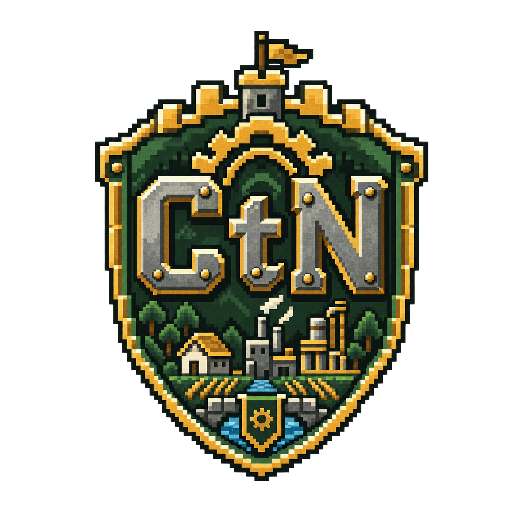

# Craft to Nation



**Craft to Nation** es un juego de supervivencia, construcción y estrategia en el que el jugador transforma un refugio en una nación industrial viva.

**Sitio web:** [crafttonation.netlify.app](https://crafttonation.netlify.app)

El proyecto está en etapa de pruebas de concepto. El desarrollo actual valida sus sistemas principales de forma incremental sobre un único proyecto de Godot, siguiendo el [GDD v3.49](Documento%20de%20Diseño%20de%20Juego%20%28GDD%29_%20Craft%20to%20Nation.md).

## Estado actual

- **Fase 0 — completada:** PoC 1 y 2 validan la lógica de recursos, demografía, nivel urbano, serialización y reglas de blueprints y zonas.
- **Fase 1 — verificada:** PoC 3 implementa el prototipo en primera persona sobre `GridMap`, minado y colocación, objetos multicelda y detección de edificios por volumen interno; reconoce habitaciones irregulares y de varios pisos y comprueba su acceso mediante pathfinding real.
- **Fase 2 — completa:** PoC 4 integra `Ciudad` y `Avatar` como autoload, zonificación y una cámara cenital navegable; PoC 8 añade colonos NPC con pathfinding propio; y el HUD incluye hotbar con iconos reales, miniaturas isométricas de edificios y navegación numérica jerárquica.
- **Fase 3 — en progreso:** PoC 6 (mundo procedural, nivelación, puestos de recolección y cuerpos de agua) está completo con alcance reducido, y PoC 5 completó minerales y las fases 2A y 2B de la economía. El mundo procedural finito de 200×200 celdas incluye dos montañas, seis minerales, mares, lagos, ríos, árboles talables y recursos agotables. Los cuatro puestos de recolección son edificios de bloques con puerta y baúl físico; `VentanaBaul` permite transferencias parciales entre el avatar y esos almacenes. La construcción manual y asistida consume materiales reales (`tierra_compactada`, `bloque_madera`, `bloque_piedra`, `estructura_hierro` y `vidrio`), devuelve recursos al minar o deconstruir e incorpora construcción fantasma pagada mediante colas temporizadas; los puestos solo se registran al terminar. Las vías de tierra pisada dan +35 % de velocidad. Ya están la siderúrgica real y las demás refinerías, la escuela técnica, las obras por colonos y los niveles de puesto con empleo por oficio (obreros, técnicos y especialistas); siguen la escuela de especialistas, la universidad e investigación, el tendido de vías por colonos y los fluidos y la energía.
- **Fases 4–7 — planeadas:** cámara dual y tropas, logística y puentes, combate e IA, y multijugador LAN.
- **Visión a largo plazo:** eras tecnológicas posteriores al nivel urbano actual y un servidor MMO por planetas, todavía sin PoC ni fase asignada.

El proyecto Godot cuenta actualmente con **523 bloques de prueba** (conteo de cabeceras `=== TEST` en los scripts) repartidos en **26 escenas** `*Test.tscn`: validación de blueprints y construcción, ciudad, zonificación, mundo, árboles, nivelación, recolección, plantillas y miniaturas de puestos, economía, extracción, colonos, rutas, vías, minerales, translúcidos, puertas, HUD y jugador.

## Ideas incorporadas al roadmap

- **Mundo procedural finito:** implementado como primer subproyecto de PoC 6.
- **Nivelación de terreno sobre relieve:** implementada y confirmada visualmente; los edificios con puerta toman como nivel el suelo natural frente a ella y los puestos periféricos se nivelan al punto más alto de su huella. La excavación produce materiales y el relleno los consume dentro de una cola temporizada.
- **Puestos de recolección y previsualización en el HUD:** minas (seis minerales por profundidad), caza y recolección, maderero y pesca y frutos del mar, colocables desde la cámara cenital con estadísticas en vivo. Son edificios de bloques con plantilla propia, y al colocarlos se previsualizan la plantilla fantasma, el despeje de puertas y ventanas y la nivelación del frente, igual que un edificio declarado. Producen recursos reales con trabajadores asignados y alimentan el almacén central.
- **HUD por modos:** barra superior con datos reales de la ciudad y panel contextual. En la cenital, el menú jerárquico admite navegación numérica, muestra miniaturas isométricas de los edificios y mantiene sincronizadas la selección y la rotación; en primera persona, la hotbar usa iconos reales y tarjetas completas. Las ventanas de población, almacén y baúl muestran información en vivo, mientras las notificaciones explican rechazos y eventos. Faltan batalla, escuadrón y salud.
- **Puertas y baúles interactivos:** las puertas se abren con `E` y reaccionan a los colonos; `VentanaBaul` permite consultar y transferir cantidades parciales entre el inventario del avatar y un baúl físico.
- **Bioma y vegetación:** implementadas las señales de fauna, frutales y árboles; el mundo genera árboles procedurales talables y el jugador puede talarlos mediante acciones repetidas.
- **Catálogo de recursos y cadenas de producción:** minerales, materiales reales de construcción, siderúrgica, refinería de tierras raras, aserradero y carbonera ya están conectados al mundo, al stock central y al acarreo. Siguen pendientes los fluidos (agua, crudo y combustible), la generación/distribución de energía y más usos de las tablas.
- **Cuerpos de agua:** implementados (mares, lagos y ríos con corriente y cascadas, agua transparente y no sólida, natación con oxígeno, escurrimiento con niveles y secado). Cauces sinuosos y un nivel de mar que dependa del tipo de mundo siguen pendientes.
- **Puentes:** previstos como PoC 10 en la Fase 5, reutilizando el trazado de las redes de transporte.
- **Tallado cosmético por celda:** previsto como pulido visual, sin fase propia.
- **Túneles y cavernas:** previstos a futuro; dependen de la generación de terreno y de las mecánicas de combate.

El contexto y la ubicación de estas ideas se conservan en [docs/ideas-backlog.md](docs/ideas-backlog.md).

## Estructura

```text
PoC_1/     Motor lógico de recursos y demografía
PoC_2/     Serialización y validación de blueprints
PoC_3/     Documento técnico del prototipo visual
PoC_4/     Documentos técnicos de ciudad y zonificación
PoC_5/     Catálogo de recursos y cadenas de producción
PoC_6/     Documentos técnicos del mundo y recolección
PoC_8/     Pathfinding a pie y colonos NPC
godot/     Proyecto compartido desde PoC 3
docs/      Especificaciones, planes e ideas del backlog
```

## Ejecutar el prototipo

1. Instala Godot 4.7.
2. Importa `godot/project.godot` (proyecto Godot compartido, usado por PoC_3 en adelante).
3. Ejecuta el proyecto con **F5**.

Para correr las pruebas de Godot, abre cada escena y usa **F6**:

- `godot/scenes/Test.tscn`
- `godot/scenes/BlueprintsTest.tscn`
- `godot/scenes/ConstruccionTest.tscn`
- `godot/scenes/CiudadTest.tscn`
- `godot/scenes/ZonificacionTest.tscn`
- `godot/scenes/GeneradorMundoTest.tscn`
- `godot/scenes/GeneradorArbolTest.tscn`
- `godot/scenes/NiveladorTerrenoTest.tscn`
- `godot/scenes/RecoleccionTest.tscn`
- `godot/scenes/CadenaMineralesTest.tscn`
- `godot/scenes/TranslucidosRendererTest.tscn`
- `godot/scenes/PlayerNatacionTest.tscn`
- `godot/scenes/PlayerOxigenoTest.tscn`
- `godot/scenes/BuscadorRutasTest.tscn`
- `godot/scenes/ColonosTest.tscn`
- `godot/scenes/FantasmasPermeablesTest.tscn`
- `godot/scenes/EconomiaTest.tscn`
- `godot/scenes/ExtraccionTest.tscn`
- `godot/scenes/ViasTest.tscn`
- `godot/scenes/PlantillasPuestoTest.tscn`
- `godot/scenes/PuertasTest.tscn`
- `godot/scenes/PuestosPrevisualizacionTest.tscn`
- `godot/scenes/CamaraCenitalModosTest.tscn`
- `godot/scenes/HUDTest.tscn`
- `godot/scenes/MiniaturaRendererTest.tscn`
- `godot/scenes/ObrasTest.tscn`

En Windows también puedes ejecutar las 26 escenas en modo headless. El script falla si Godot devuelve un código distinto de cero, registra `ERROR:`/`SCRIPT ERROR` o una escena no llega a su mensaje final:

```powershell
.\tools\run-godot-tests.ps1 -GodotPath "C:\ruta\a\godot.exe"
```

## Contribuir

Consulta [CONTRIBUTING.md](CONTRIBUTING.md) antes de enviar cambios. Se aceptan aportes humanos o asistidos por IA siempre que quien los envía los haya revisado y pueda responder por ellos.

## Licencias

- El código fuente se distribuye bajo la [licencia MIT](LICENSE).
- La documentación y los recursos originales se distribuyen bajo [CC BY 4.0](LICENSE-CONTENT.md).
- El nombre y los logotipos de Craft to Nation no quedan licenciados para identificar proyectos derivados.
